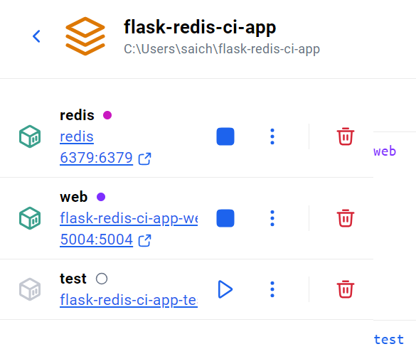
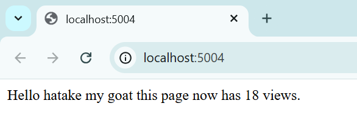
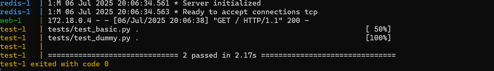

# 🐍 Flask + Redis App with Pytest & Docker Compose

This project demonstrates a simple Flask app integrated with Redis, containerized using Docker Compose. It includes a basic CI-style test setup using Pytest in a separate container.

---

## 🚀 Features

- 🧠 Redis for tracking page views  
- 🐳 Dockerized using multi-container setup (Flask, Redis, Pytest)  
- ✅ Automated testing with Pytest  
- 📷 Screenshots included for structure, containers, and test results  

---

## 📂 Project Structure

```bash
flask-redis-ci-app/
├── docker-compose.yml
├── Dockerfile.test
├── redis/
├── test/
├── web/
│   ├── app.py
│   ├── Dockerfile
│   ├── requirements.txt
│   └── tests/
│       ├── test_basic.py
│       └── test_dummy.py
└── screenshots/
    ├── project-structure.png
    ├── docker-containers.png
    ├── localhost.png
    └── pytest-results.png
```


---

## 🐋 Docker Setup

### 🔧 Build & Run

```bash
docker-compose up --build --force-recreate
```

This will:
- Start Redis container  
- Build and start Flask app  
- Run tests inside a separate `test` container  



---

## 🌐 Localhost App Preview

Flask app runs at:  
📍 `http://localhost:5004`  

It shows the number of times the homepage has been visited (stored in Redis).



---

## 🧪 Testing

Pytest is run in a separate container at startup.  

Test files:  
- `test_basic.py`: Tests the `/` route response.  
- `test_dummy.py`: Simple dummy test to validate setup.  



---

## ✅ Final Notes

- All containers shut down automatically after test completion  
- Redis container includes modules like RediSearch, ReJSON, etc., for extensibility  
- This setup mimics a real-world CI pipeline locally with isolated environments  

---
